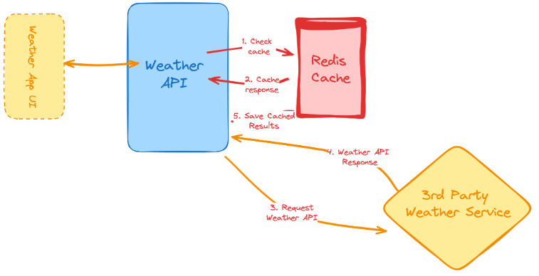
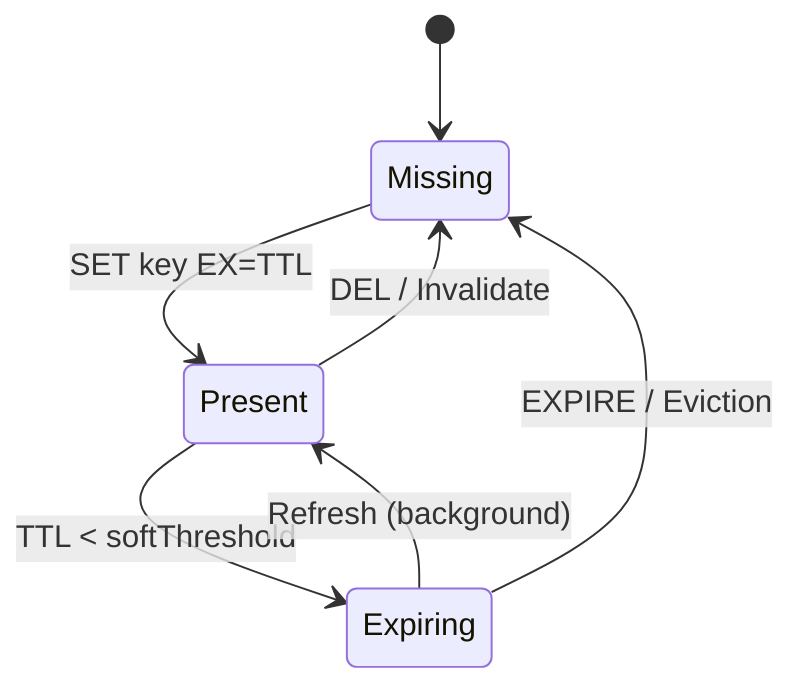
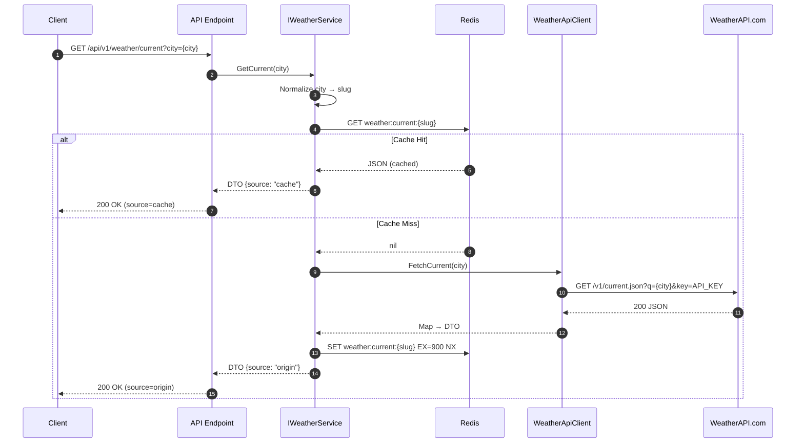
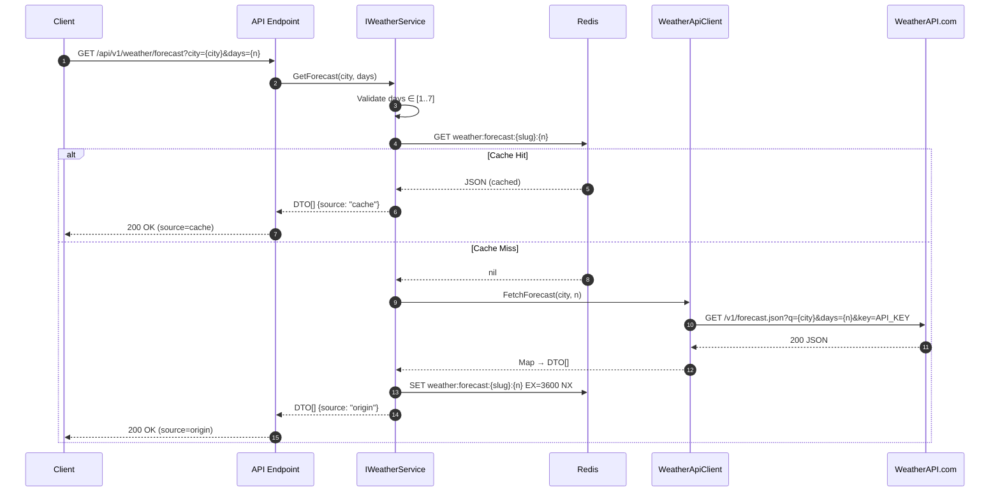
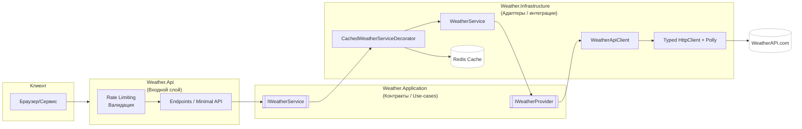
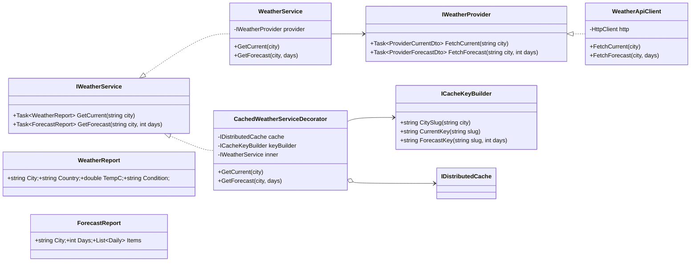
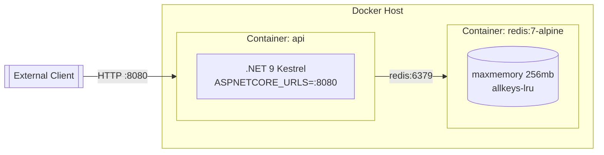

# **Weather Proxy API** *(.NET + Redis + WeatherAPI.com)*

> Небольшой проект взятый на с сайта Roadmap.sh
([Roadmap.sh](https://roadmap.sh/projects/weather-api-wrapper-service))

---

## **Описание проекта** *(инструкция с сайта)*

В этом проекте вместо того, чтобы использовать собственные данные о погоде, мы создадим погодный API, который будет получать и возвращать данные о погоде из стороннего API.

---

### Содержание проекта

- **Внешний API** погоды, буду использовать "<https://www.weatherapi.com/>"
- В качестве кеша, буду использовать **Redis**
    > Подробнее: "<https://redis.io/docs/latest/develop/clients/client-side-caching/>"

# **Этап №1** Проектирование

## Основной технологический стек

### Язык програмирование

- **C# / .NET 9 (ASP.NET Core Web API)** — современный стек, минимальные контроллеры/эндпоинты, DI «из коробки», Rate Limiting, HealthChecks.

### Технологии (платформа и библиотеки)

- **HTTP-клиент**: HttpClientFactory + Polly (таймауты, ретраи с экспонентой и джиттером, circuit-breaker).
- **Кэш**: Redis через IDistributedCache (StackExchange.Redis).
- **Документация**: Swagger (Swashbuckle).
- **Ограничение скорости**: Microsoft.AspNetCore.RateLimiting.
- **Конфигурация/секреты**: appsettings.json + ENV + dotnet user-secrets.
- **Логи**: Microsoft.Extensions.Logging (опционально — Serilog).
- **Тесты**: xUnit + FluentAssertions + WebApplicationFactory; опционально Testcontainers для Redis.
- **Контейнеризация**: Dockerfile + docker compose.

## Архитектура (Clean Architecture)

**Weather.Api** — вход: HTTP, эндпоинты, Swagger, rate limiting, ProblemDetails
**Weather.Application** — контракты/интерфейсы use-case’ов, DTO и валидаторы
**Weather.Domain** — доменная модель (без зависимостей)
**Weather.Infrastructure** — адаптеры: WeatherAPI client, Redis cache, декораторы

**Weather.Api.Tests** / Weather.Application.Tests / Weather.Infrastructure.Tests

## Ключевые файлы и их роль

- **Weather.Api/Program.cs** — настраиваю DI, Swagger, Rate Limiting, маршруты /api/v1/..., централизованную обработку ошибок.
- **Weather.Application/IWeatherService.cs** — объявляю фасад для сценария «получить погоду».
- **Weather.Application/IWeatherProvider.cs** — объявляю порт к внешнему поставщику (WeatherAPI).
- **Weather.Domain/WeatherReport.cs** — описываю доменную модель ответа (температура, состояние, ветер и т.д.).
- **Weather.Infrastructure/WeatherApiClient.cs** — реализую вызов внешнего API (Typed HttpClient + Polly).
- **Weather.Infrastructure/WeatherService.cs** — реализую IWeatherService: валидирую вход, обращаюсь к кэшу/провайдеру.
- **Weather.Infrastructure/CachedWeatherServiceDecorator.cs** — использую код города, введённый пользователем, в качестве ключа и сохраняю там результат вызова API (cache-aside с TTL).
- **appsettings.json** — базовые настройки; секреты (ключ API/строка Redis) — только через ENV.

## Стратегия кэширования (Redis)

- **Формулировка единая**: использую код города, введённый пользователем, в качестве ключа и сохраняю там результат вызова API (с установленным TTL).
- **Паттерн**: cache-aside (lazy caching).
- **Ключи**:
  - weather:current:{city-slug}
  - weather:forecast:{city-slug}:{days}
- **Нормализация ключей**: city → city-slug = ToLowerInvariant().Trim().Replace(' ', '-')
- **Значение**: сериализованный JSON моего DTO.
- **TTL**: текущая погода — 10–15 минут; прогноз — 30–60 минут.
- **Dogpile prevention** (опционально): мягкий TTL/раннее продление; защита от штормов — небольшой distributed lock.
- **Важно**: ограничиваю память Redis и включаю политику вытеснения (LRU).

## Контракты API

> **GET** /api/v1/weather/current?city={name}
> Код: **200 OK**

    {
    "city": "Helsinki",
    "country": "Finland",
    "tempC": 19.7,
    "tempF": 67.5,
    "condition": "Partly cloudy",
    "windKph": 13.2,
    "humidity": 62,
    "fetchedAtUtc": "2025-09-05T20:10:00Z",
    "source": "cache | origin"
    }

---

- *Ошибки: 400 (валидация)*
- *404 (город не найден у поставщика)*
- *429 (лимит)*
- *503 (внешний недоступен).*
Формат ошибок — ProblemDetails.

> **GET** /api/v1/weather/forecast?city={name}&days=3

- Валидирую days (1..7) и использую код города, введённый пользователем, в качестве ключа и сохраняю там результат вызова API (отдельный ключ/TTL).

## Конфигурация

Переменные окружения (пример .env)

    ASPNETCORE_ENVIRONMENT=Development
    WEATHERAPI__BASEURL=https://api.weatherapi.com/v1/
    WEATHERAPI__APIKEY=***your_api_key***
    REDIS__CONNECTIONSTRING=redis:6379,abortConnect=false
    CACHING__CURRENTTTLMINUTES=15
    CACHING__FORECASTTTLMINUTES=60
    HTTP__TIMEOUTSECONDS=8

appsettings.json (фрагмент)

    {
        "WeatherApi": { "BaseUrl": "https://api.weatherapi.com/v1/", "ApiKey": "" },
        "Redis": { "ConnectionString": "localhost:6379,abortConnect=false" },
        "Caching": { "CurrentTtlMinutes": 15, "ForecastTtlMinutes": 60 },
        "Http": { "TimeoutSeconds": 8 },
        "RateLimiting": { "PermitPerMinute": 60, "Burst": 10 }
    }

## Запуск

Локально (без Docker)

    dotnet build
    dotnet run --project src/Weather.Api
    # Swagger: http://localhost:8080/swagger

Docker + Redis

    services:
    api:
        build: ./src/Weather.Api
        environment:
        - ASPNETCORE_URLS=http://+:8080
        - WEATHERAPI__BASEURL=${WEATHERAPI__BASEURL}
        - WEATHERAPI__APIKEY=${WEATHERAPI__APIKEY}
        - REDIS__CONNECTIONSTRING=redis:6379,abortConnect=false
        ports:
        - "8080:8080"
        depends_on:
        - redis

    redis:
        image: redis:7-alpine
        command: ["redis-server", "--maxmemory", "256mb", "--maxmemory-policy", "allkeys-lru"]
        ports:
        - "6379:6379"

## Безопасность и надёжность

- **Входные данные:** whitelist символов города, ограничение длины, тримминг.
- **Исходящие вызовы:** фиксирую базовый URL, запрещаю лишние редиректы, ставлю таймаут.
- **Секреты:** храню только в ENV/Secret Manager; не логгирую ключи.
- **Rate Limiting:** per-IP (на старте), можно перейти на ключ клиента (X-Api-Key).
- **Логи:** структурные, с корреляцией (TraceId в ответе ошибок).
- **Health checks:** /health для liveness/readiness.
  
---

## 1) Диаграмма кэша (TTL)

**Пояснение.** Ключ в Redis проходит состояния: отсутствует (**Missing**) → появляется после записи (**Present**) → приближается к истечению (**Expiring**) → либо продлевается фоновым обновлением (**Refresh**), либо удаляется/вытесняется (**Missing**). На всех путях кэширования **использую код города, введённый пользователем, в качестве ключа и сохраняю там результат вызова API** с заданным TTL.

## 2) Последовательность: `GET /api/v1/weather/current?city={city}`

**Пояснение.** Сначала проверяю кэш по ключу `weather:current:{city-slug}`. При промахе обращаюсь к внешнему API, мапплю ответ в DTO и **сохраняю результат вызова API** в Redis с TTL (например, 15 минут).

## 3) Последовательность: `GET /api/v1/weather/forecast?city={city}&days={n}`

**Пояснение.** Для прогноза использую отдельный ключ `weather:forecast:{city-slug}:{days}` и более длинный TTL (например, 60 минут).

## 4) Компоненты/слои (Clean Architecture)

**Пояснение.** Входной слой (`Weather.Api`) ничего «не знает» о способах получения данных — он вызывает порт `IWeatherService` из слоя Application. Реализация живёт в Infrastructure и обёрнута декоратором кэша. Такой разрез обеспечивает слабую связанность и тестопригодность.

## 5) Диаграмма классов (интерфейсы/реализации)

**Пояснение.** `IWeatherService` — внешний порт для API. Базовую логику инкапсулирует `WeatherService`, а `CachedWeatherServiceDecorator` добавляет кэширование, **используя код города, введённый пользователем, в качестве ключа и сохраняя там результат вызова API**.

## 6) Развёртывание (Docker compose)

**Пояснение.** API и Redis поднимаю в отдельных контейнерах. Сервис общается с Redis по внутренней сети Docker, наружу пробрасывается только порт API.
